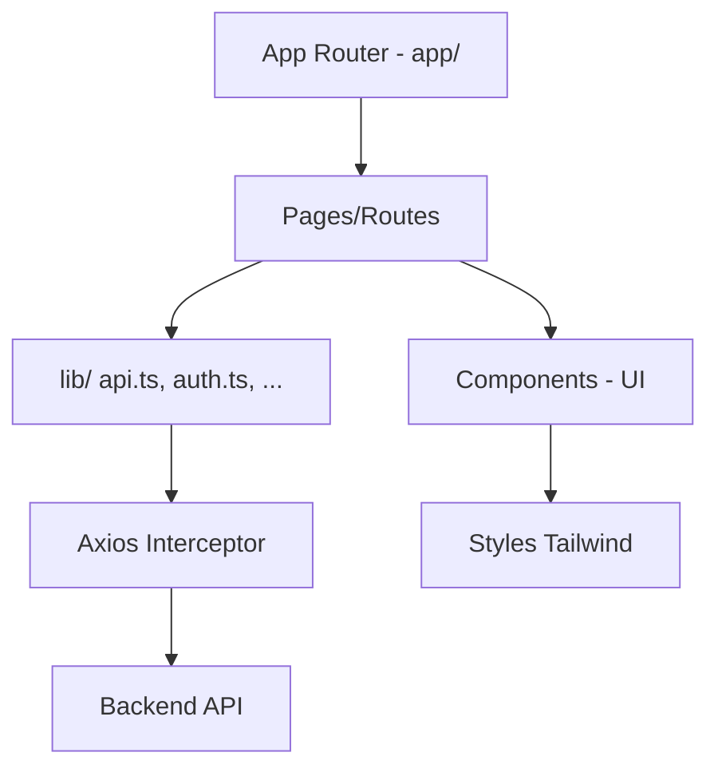

# Frontend - Parking System

Aplicación frontend para la gestión de un sistema de estacionamiento (parking), construida con Next.js 14, React 18, Tailwind CSS y la librería de componentes basada en Radix UI.

## Características
- Autenticación con token (guardado en `localStorage`).
- Consumo de API centralizado con Axios (`lib/api.ts`).
- UI moderna con componentes reutilizables (`components/`).
- Soporte de temas (dark/light) y diseño responsivo.

## Tech Stack
- Next.js 14
- React 18
- Tailwind CSS 4
- Radix UI / shadcn-ui (componentes)
- Axios
- Zod (validaciones)

## Requisitos
- Node.js >= 18
- pnpm o npm (recomendado pnpm)

## Scripts
- `pnpm dev` (o `npm run dev`): Levanta el entorno de desarrollo.
- `pnpm build` (o `npm run build`): Construye la app para producción.
- `pnpm start` (o `npm run start`): Sirve la app construida.
- `pnpm lint` (o `npm run lint`): Linter de Next.js.

## Variables de entorno
Este proyecto utiliza variables expuestas al navegador con prefijo `NEXT_PUBLIC_`.

Archivo de ejemplo: `.env.example`

```
# URL base del backend o gateway de APIs
NEXT_PUBLIC_API_URL=http://localhost:3000/api
```

- Copia `.env.example` a `.env.local` o `.env` y ajusta los valores para tu entorno.
- En tiempo de ejecución, el cliente HTTP (Axios) usa `NEXT_PUBLIC_API_URL` (ver `lib/api.ts`). Si no se define, por defecto usa `http://localhost:3000/api`.

## Estructura del proyecto (parcial)
```
app/
  login/
  forgot-password/
  employees/
  billing/
components/
  ui/
lib/
  api.ts
  auth.ts
  employees.ts
  parkings.ts
styles/
  globals.css
```

## Desarrollo
1. Instalar dependencias:
   ```bash
   pnpm install
   # o
   npm install
   ```
2. Preparar variables de entorno:
   ```bash
   cp .env.example .env.local
   # editar .env.local con tus valores
   ```
3. Ejecutar en modo dev:
   ```bash
   pnpm dev
   # o
   npm run dev
   ```

La app estará disponible por defecto en `http://localhost:3000`.

## Construcción y producción
```bash
pnpm build
pnpm start
```

## Linting
```bash
pnpm lint
```

## Notas de seguridad
- Nunca subas tus credenciales reales al repositorio. Usa `.env.local` y conserva `.env.example` con valores dummy.
- El token de sesión se almacena en `localStorage` para las peticiones autenticadas (ver interceptor en `lib/api.ts`). Ajusta la estrategia si requieres mayor seguridad (cookies httpOnly, etc.).

## Convenciones
- Componentes reutilizables en `components/`.
- Clientes y utilidades en `lib/`.
- Rutas y páginas en `app/` (App Router de Next.js).

## Despliegue
- Este proyecto puede desplegarse fácilmente en Vercel o Netlify.
- Asegúrate de configurar `NEXT_PUBLIC_API_URL` en las variables de entorno del proveedor.

## Licencia
Propietario del proyecto. Si necesitas agregar una licencia OSS (MIT, Apache-2.0, etc.), indícalo.

## Visión del proyecto
El objetivo de este frontend es permitir la operación diaria de un sistema de estacionamiento con una interfaz clara y eficiente, minimizando errores operativos y acelerando tareas repetitivas como check-in/check-out de vehículos, cálculo de tarifas y gestión de empleados.

## Módulos funcionales
- **Dashboard (futuro):** métricas en tiempo real (ocupación, ingresos diarios, tickets abiertos).
- **Parking:**
  - Registro de ingreso/salida de vehículos.
  - Cálculo de tarifas según reglas (por hora, fracción, estadías, validaciones).
  - Búsqueda por patente/placa, ticket o cochera.
- **Empleados:**
  - Alta/baja/modificación de usuarios operativos.
  - Asignación de roles y permisos.
- **Facturación / Billing:**
  - Emisión de tickets/boletas.
  - Reportes por rango de fechas.
  - Exportación (CSV/Excel) futuro.

## Roles y permisos (sugerencia)
- **Administrador:** Acceso a todos los módulos y reportes; gestiona empleados y tarifas.
- **Operador:** Alta/baja de tickets, cobros y consultas básicas.

## Navegación principal
Rutas actuales basadas en `app/`:
- `/login` → Autenticación.
- `/forgot-password` → Recuperación de contraseña.
- `/employees` → Gestión de empleados.
- `/billing` → Facturación y cobros.
- `/` (por definir) → Dashboard o landing interna.

## Flujo de autenticación (resumen)
```mermaid
flowchart LR
  A[Usuario] --> B[/login]
  B -->|POST /auth/login| C{Credenciales válidas?}
  C -->|Sí| D[Guardar token en localStorage]
  D --> E[Navegación a app privada]
  C -->|No| F[Mostrar error]
```

El token se inyecta automáticamente en cada request por el interceptor Axios (`lib/api.ts`).

## Endpoints de ejemplo (backend esperado)
Los endpoints se construyen sobre `NEXT_PUBLIC_API_URL`.
- `POST /auth/login` → Body: `{ email, password }` → Respuesta: `{ token }`.
- `GET /employees` → Lista de empleados.
- `POST /employees` → Crear empleado.
- `GET /parkings/:id` → Detalle de ticket/estancia.
- `POST /billing/charge` → Cobro de ticket.

> Nota: Estos endpoints son de referencia. Ajusta nombres y payloads según tu backend real.

## Estados y manejo de errores
- **Cargando:** Pantallas `loading.tsx` en `app/*` para feedback inmediato.
- **Errores de red/401:** Redirección a `/login` o notificación. Revisar interceptor y manejo de toasts.
- **Estados vacíos:** Tablas/listas con placeholders y CTAs para crear registros.

    
## Arquitectura Frontend (alto nivel)


## Roadmap (propuesto)
- [ ] Dashboard con métricas (ocupación, ingresos, tickets activos).
- [ ] Gestión de tarifas/planes.
- [ ] Búsqueda avanzada y filtros por tiempo/sector.
- [ ] Exportación de reportes (CSV/Excel).
- [ ] Tests E2E y unitarios.
- [ ] Internacionalización (i18n).

## FAQ
- **¿Dónde configuro la URL del backend?** En `.env.local` usando `NEXT_PUBLIC_API_URL`.
- **¿Puedo usar cookies httpOnly en vez de localStorage?** Sí, pero requerirá ajustes en el backend y en el flujo de autenticación.
- **¿Se puede desplegar en Vercel?** Sí. Configura las variables en el panel del proveedor.
